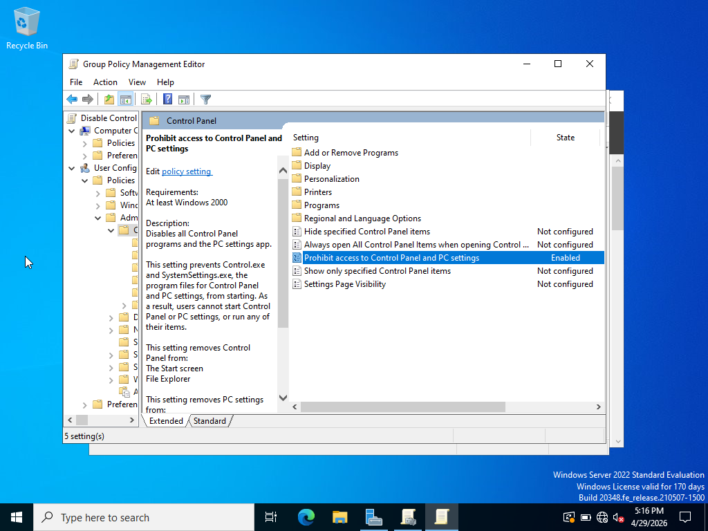
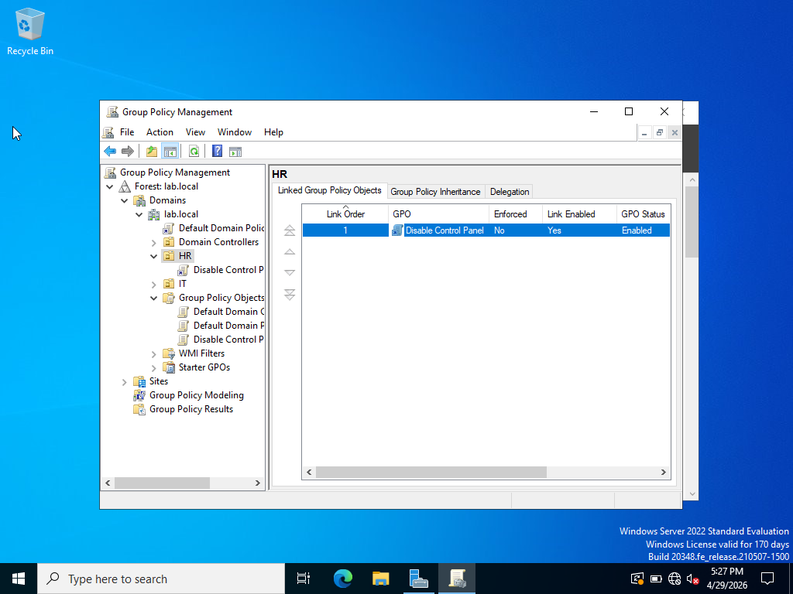
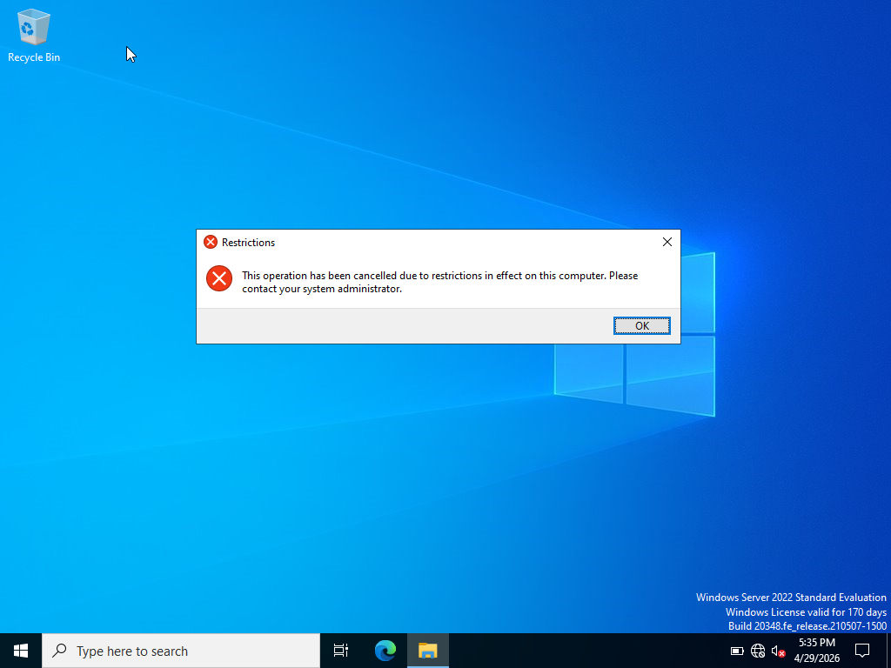

# Active Directory Group Policy – Control Panel Restriction

## Overview

This lab demonstrates how I configured and applied a Group Policy Object (GPO) in an Active Directory home lab to restrict access to Control Panel and PC settings for users within the HR Organizational Unit (OU).

The exercise provided hands-on practice with creating and configuring Group Policy, linking a GPO to an OU, and verifying that the policy restriction was successfully applied.

> **Note:** This is a personal home lab created for hands-on learning and does not represent professional production experience.

## Lab Environment

- Windows Server 2022
- Active Directory Domain Services (AD DS)
- Group Policy Management
- Active Directory Users and Computers (ADUC)
- Domain: `lab.local`
- HR Organizational Unit

## Skills Practiced

- Group Policy administration
- Organizational Unit management
- Configuring user policies
- Linking GPOs to Organizational Units
- Policy scope and targeting
- Testing and verifying policy application

## Scenario

The goal was to prevent users within the HR OU from accessing Control Panel and PC settings.

I created a GPO named `Disable Control Panel` and configured the following policy:

`User Configuration → Policies → Administrative Templates → Control Panel → Prohibit access to Control Panel and PC settings`

The policy was set to **Enabled** and the GPO was linked to the HR OU.

## 1. Configure the Control Panel Restriction

The **Prohibit access to Control Panel and PC settings** policy was configured as Enabled.

## 2. Link the GPO to the HR OU

The `Disable Control Panel` GPO was linked to the HR OU so that the user policy would apply within the intended Active Directory scope.

## 3. Verify the Restriction

After the policy was applied, I tested access to Control Panel from a domain user session within the lab environment.

Windows displayed a restriction message indicating that the operation had been cancelled due to restrictions in effect on the computer.

This verified that the configured Group Policy restriction was being enforced for the tested user session.

## What I Learned

This lab helped me understand how Group Policy can be used to centrally manage user settings in an Active Directory environment.

I also gained a better understanding of the relationship between Organizational Units and GPO scope. Configuring a policy alone is not enough—the GPO must be linked to the appropriate location in Active Directory so that it targets the intended users.

Finally, testing the restriction reinforced the importance of verifying that a policy actually produces the expected result rather than assuming that configuration alone means it is working.
