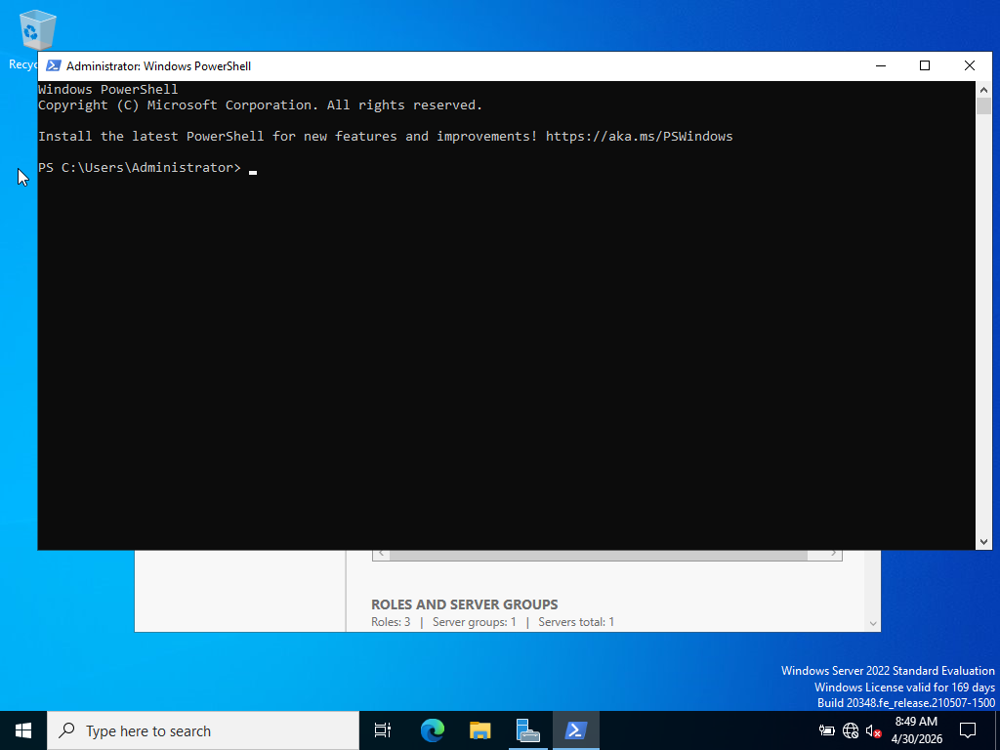
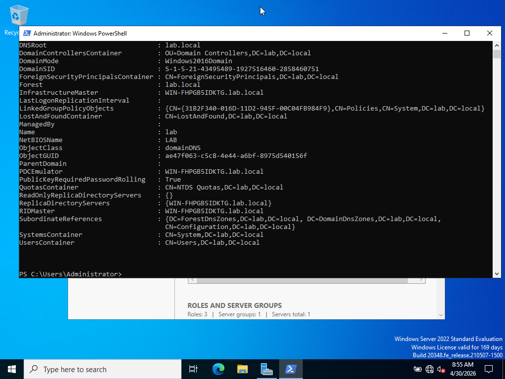
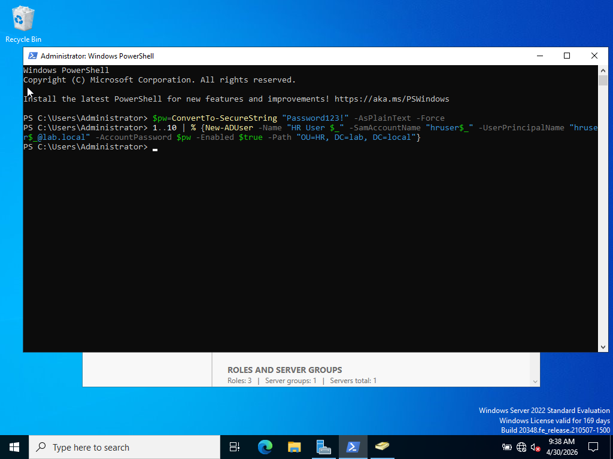
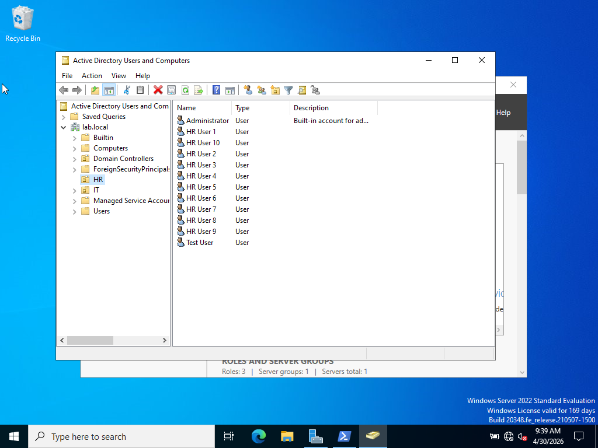

Lab Title: Lab 15 – Bulk User Creation with PowerShell

Objective:
The objective of this lab is to automate the creation of multiple user accounts in Active Directory using PowerShell. This demonstrates the ability to manage users efficiently and reduce manual administrative effort.

---

Step 1: Open PowerShell as Administrator

PowerShell was opened with administrative privileges to ensure sufficient permissions to create Active Directory user accounts.

---

Step 2: Verify Domain Environment

The Active Directory domain environment was verified to ensure proper connectivity and configuration before executing the script.

---

Step 3: Create PowerShell Script for Bulk Users

A PowerShell command was written to generate multiple user accounts. A secure password was created and applied to each account. The script loops through a sequence to create multiple users within the HR Organizational Unit.

---

Step 4: Verify Bulk User Creation in Active Directory

After executing the script, Active Directory Users and Computers was opened to confirm that the users were successfully created. Multiple user accounts (HR User 1 through HR User 10) were visible within the HR Organizational Unit.

---

Conclusion:

In this lab, bulk user account creation was successfully automated using PowerShell. This method significantly improves efficiency compared to manual account creation and reflects real-world system administration practices. The lab reinforced skills in scripting, Active Directory management, and automation.
