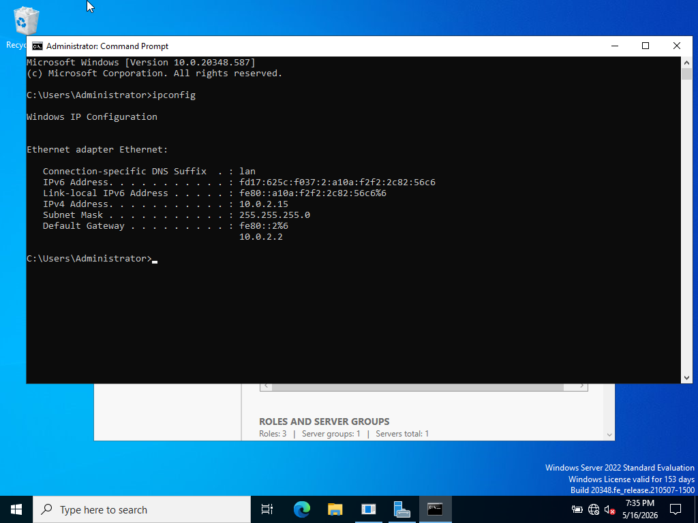
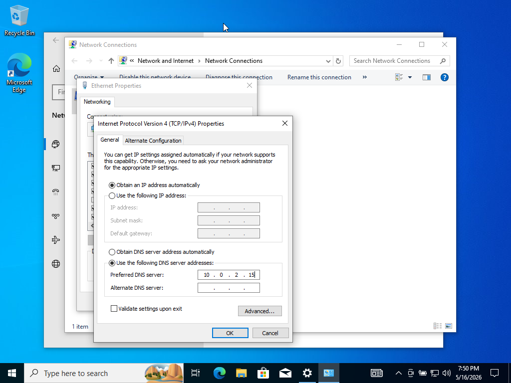
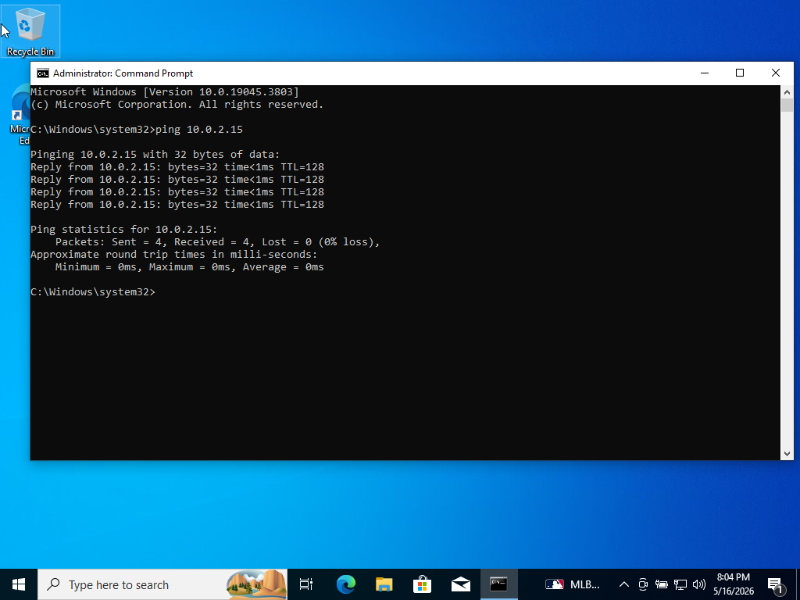
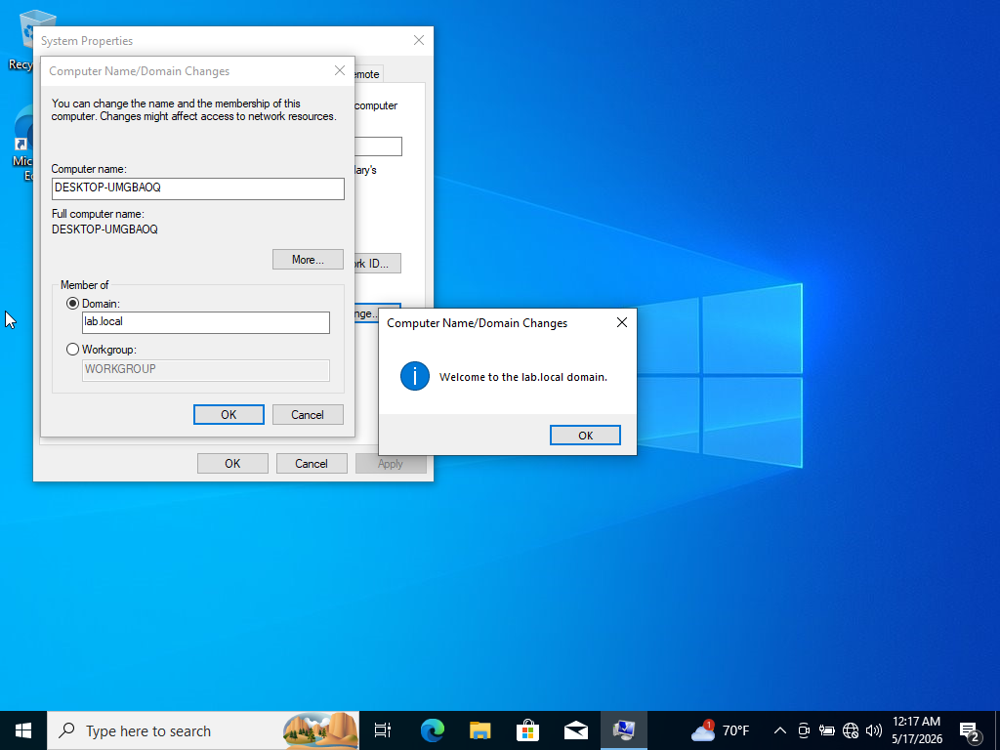
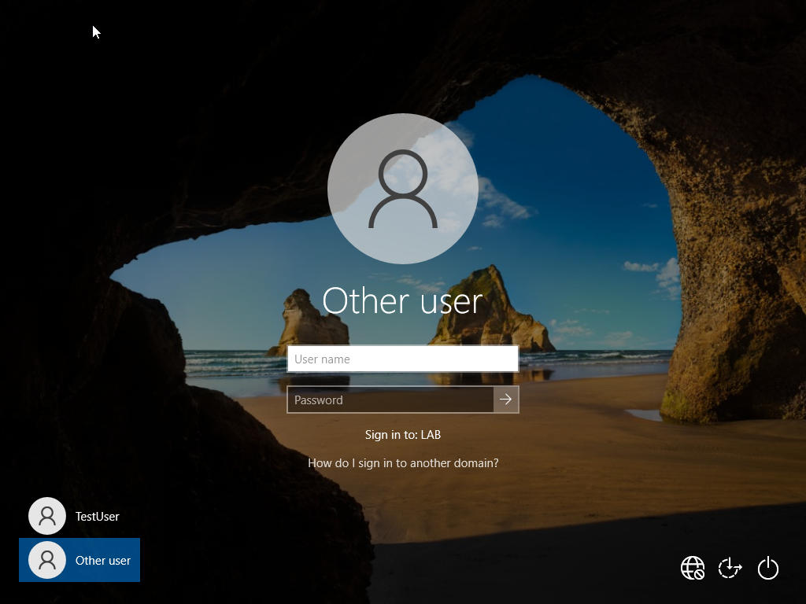

# Windows Client Domain Join & Troubleshooting

## Project Overview

This lab documents my hands-on practice joining a Windows 10 client to a Microsoft Active Directory domain in a virtualized home lab.

The exercise focused on an important requirement for Active Directory connectivity: ensuring that the client can communicate with the domain controller and is configured to use the appropriate DNS server before attempting the domain join.

> **Note:** This is a personal home lab created for hands-on learning and does not represent professional production experience.

## Lab Environment

- **Domain Controller:** DC01
- **Server OS:** Windows Server 2022
- **Client OS:** Windows 10
- **Domain:** `lab.local`
- **Domain Controller IP:** `10.0.2.15`
- **Virtualization:** Oracle VirtualBox

## Skills Practiced

- Windows domain joins
- Active Directory connectivity
- Client DNS configuration
- TCP/IP troubleshooting
- Network connectivity testing
- Windows system configuration
- Troubleshooting and verification

## 1. Verify Domain Controller Network Configuration

Before configuring the Windows client, I verified the network configuration of DC01.

The domain controller was using IPv4 address `10.0.2.15`.

## 2. Configure Client DNS

I configured the Windows 10 client's preferred DNS server as `10.0.2.15`, pointing the client to the DNS server used by the Active Directory environment.

Correct DNS configuration is important in an Active Directory environment because clients rely on DNS to locate domain services.

## 3. Verify Network Connectivity

Before attempting the domain join, I tested connectivity from the Windows client to `10.0.2.15`.

The ping completed successfully with four replies and 0% packet loss, confirming IP connectivity between the client and that address.

> A successful ping to an IP address confirms IP connectivity, but it does not by itself verify DNS name resolution.

## 4. Join the Client to the Active Directory Domain

After configuring the client and verifying connectivity, I joined the Windows 10 computer to the `lab.local` domain.

Windows returned the message:

**"Welcome to the lab.local domain."**

This confirmed that the domain join completed successfully.

## 5. Verify Domain Sign-In Availability

After the domain join and restart, the Windows sign-in screen displayed:

**"Sign in to: LAB"**

This confirmed that the client recognized the domain and presented the option to sign in using domain credentials.

## Troubleshooting Experience

While building and maintaining this Active Directory lab, I also encountered a DNS-related issue after adding an additional NAT network adapter to the domain controller for internet access.

The additional adapter registered its address in DNS, which caused unreliable Active Directory communication.

I reviewed the network adapter's advanced DNS settings and disabled:

**"Register this connection's addresses in DNS"**

for the NAT adapter.

After making the change, I verified domain controller connectivity, DNS functionality, internet connectivity, and Active Directory functionality.

This reinforced an important lesson from the lab: Active Directory depends heavily on correct DNS configuration, and network adapter changes on a domain controller can affect domain communication if DNS registration is not configured appropriately.

## What I Learned

This lab helped me understand that joining a Windows computer to an Active Directory domain involves more than entering a domain name.

The client must be able to communicate with the domain controller, and DNS must be configured correctly so Active Directory services can be located.

It also gave me practical troubleshooting experience with how network adapter and DNS configuration can affect Active Directory reliability.

## Interview Memory Anchor

**DC IP → Client DNS → Test connectivity → Join domain → Restart → Verify**

If a domain join fails, one of the first areas I would investigate is the client's DNS configuration and its ability to communicate with the domain controller.
