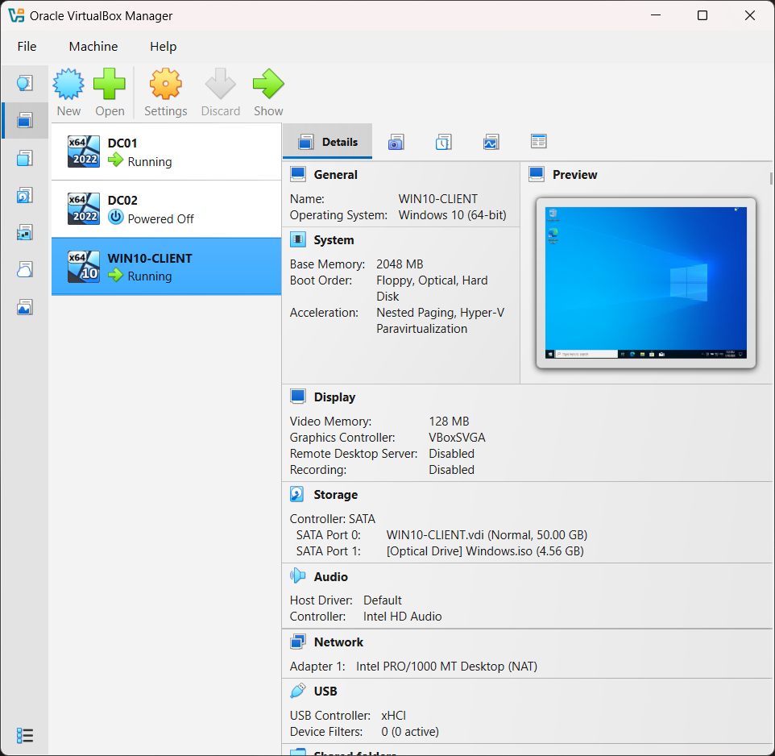
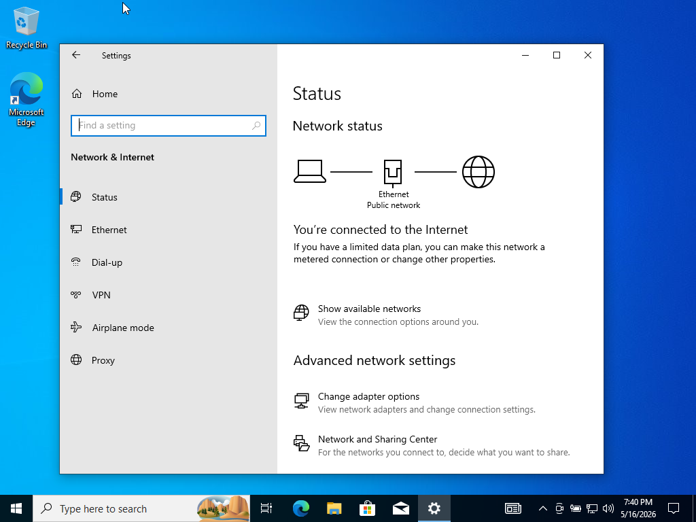
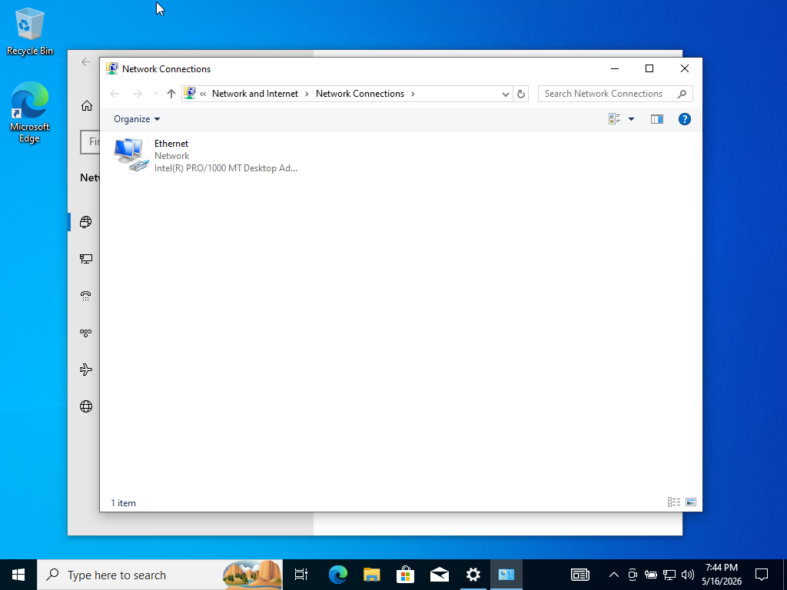
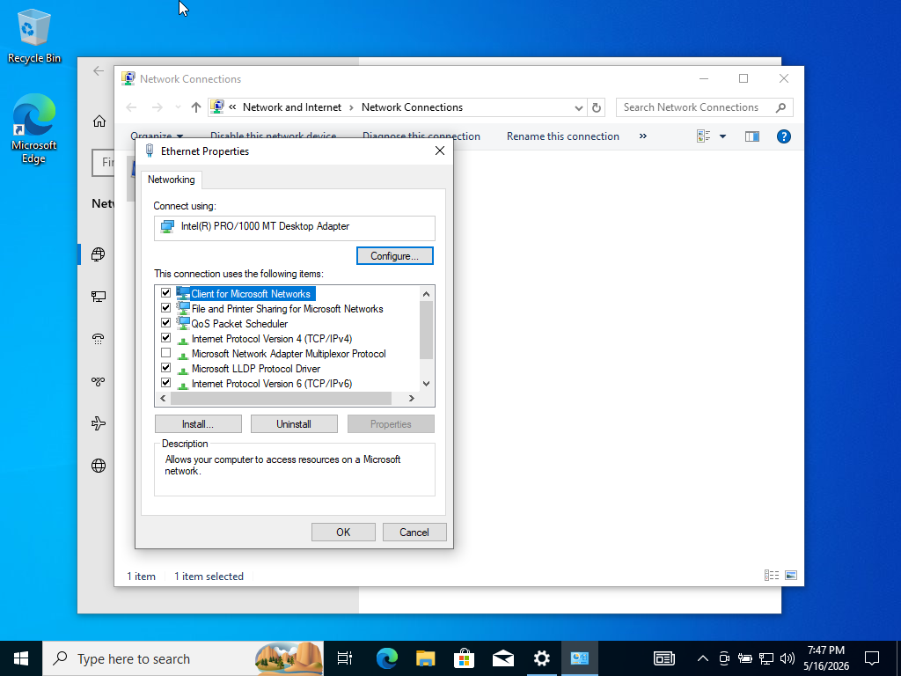
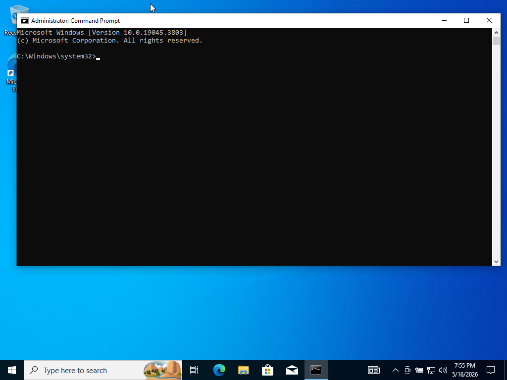
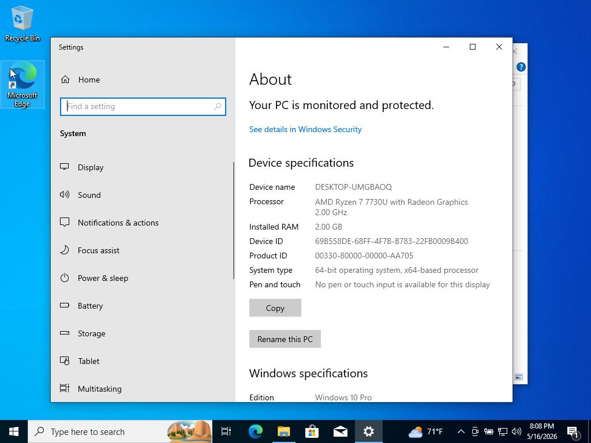
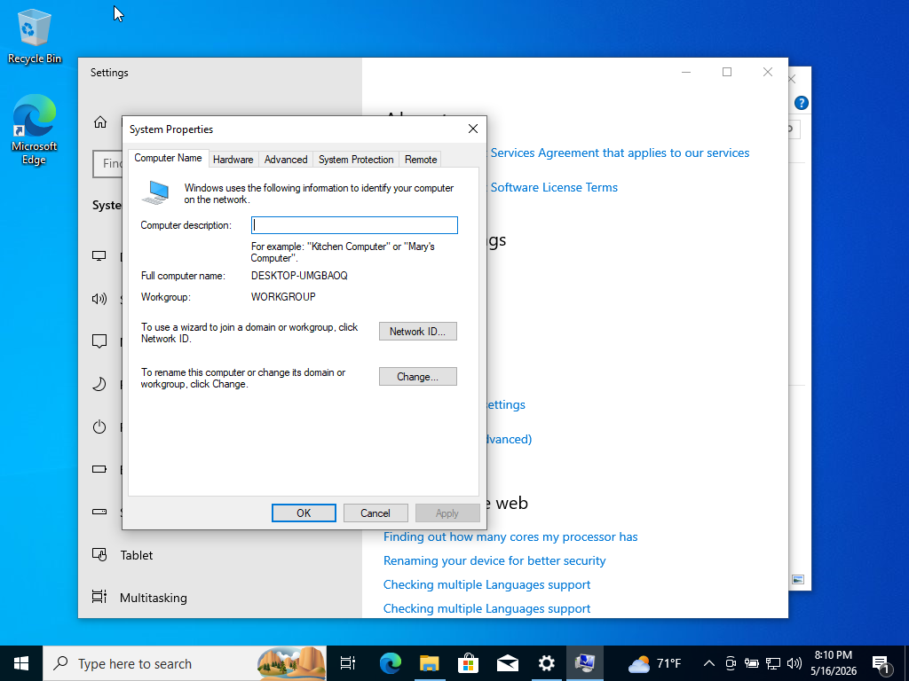
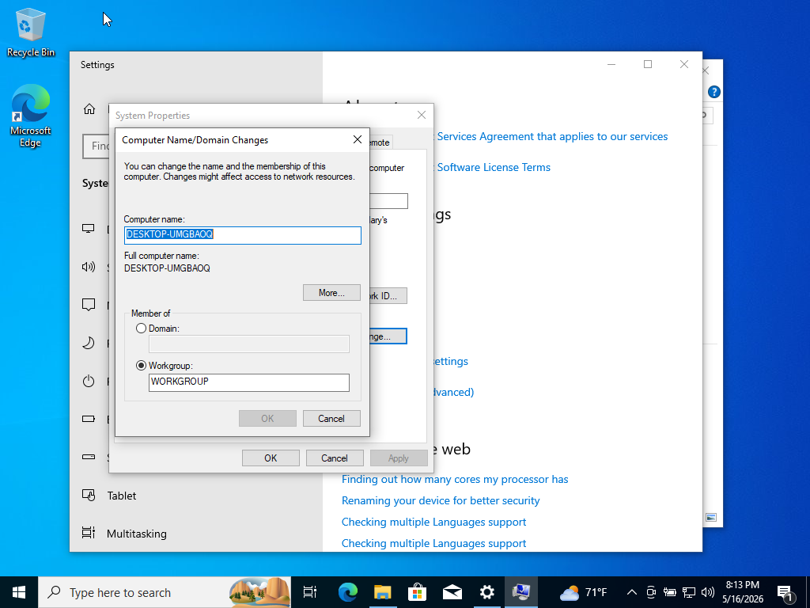
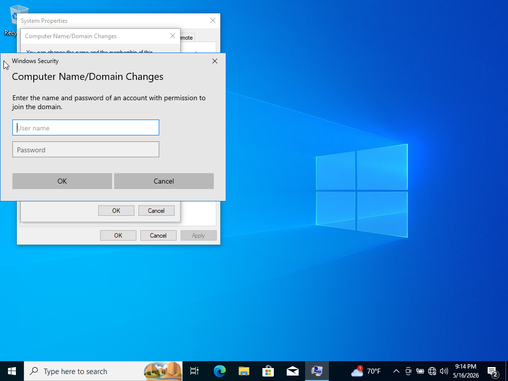
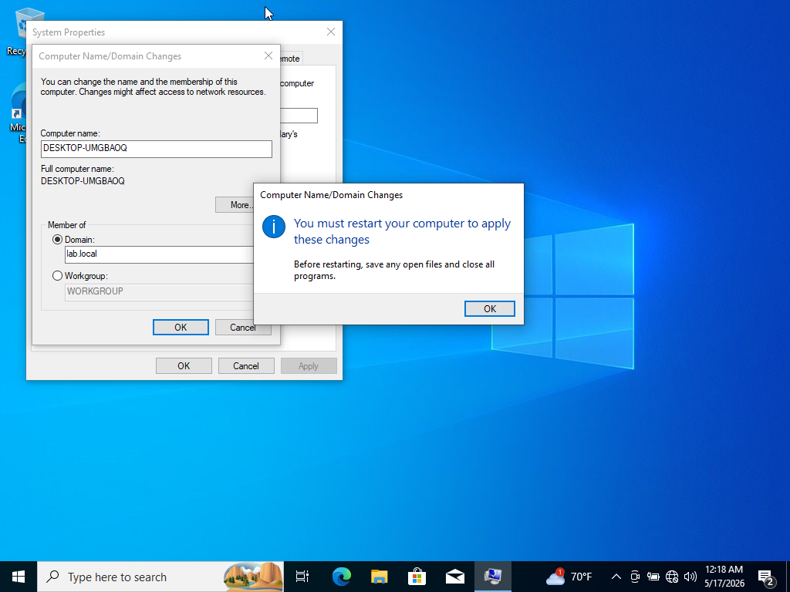

# Lab 17 – Joining a Windows 10 Client to an Active Directory Domain

## Lab Title
Join Windows 10 Client to Active Directory Domain

## Objective
The objective of this lab was to connect a Windows 10 client machine to the Active Directory domain hosted on the Domain Controller (DC01). This included verifying network connectivity, configuring DNS settings, testing communication between systems, and successfully joining the Windows client to the lab.local domain.

---

# Lab Environment

| Device | Role | Operating System |
|---|---|---|
| DC01 | Domain Controller | Windows Server 2022 |
| WIN10-CLIENT | Client Machine | Windows 10 Pro |
| Virtualization Platform | Oracle VirtualBox | Windows Host |

---

# Steps Performed

## Step 1 – Verified Both Virtual Machines Were Running

Both the Domain Controller and Windows 10 client virtual machines were powered on in Oracle VirtualBox Manager before beginning the domain join process.

### Screenshot

---

## Step 2 – Verified DC01 IP Configuration

Opened Command Prompt on the Domain Controller and used the `ipconfig` command to verify the IPv4 address being used by DC01.

The Domain Controller IP address was confirmed as:

- IP Address: `10.0.2.15`

This address would later be used as the DNS server for the Windows 10 client.

### Screenshot


---

## Step 3 – Opened Windows 10 Network Settings

Opened the Network & Internet settings page on the Windows 10 client to begin network configuration.

### Screenshot


---

## Step 4 – Opened Network Adapters

Navigated to the Network Connections window to access the Ethernet adapter configuration settings.

### Screenshot

---

## Step 5 – Opened Ethernet Adapter Properties

Opened the Ethernet adapter properties window and selected Internet Protocol Version 4 (TCP/IPv4) to modify DNS settings.

### Screenshot

---

## Step 6 – Configured DNS Server

Configured the Windows 10 client to use the Domain Controller as its preferred DNS server.

DNS Server Configured:
- Preferred DNS Server: `10.0.2.15`

This step is critical because Active Directory relies heavily on DNS for locating domain services and authentication.

### Screenshot


---

## Step 7 – Opened Command Prompt on Windows 10 Client

Opened Command Prompt on the Windows 10 client to test network communication with the Domain Controller.

### Screenshot

---

## Step 8 – Verified Connectivity with Ping Test

Tested communication between the Windows 10 client and the Domain Controller using the `ping` command.

Command Used:
```cmd
ping 10.0.2.15
```

The ping test returned successful replies, confirming network connectivity between both systems.

### Screenshot


---

## Step 9 – Opened Windows System Properties

Opened the Windows “About” page to access advanced system configuration settings required for domain joining.

### Screenshot


---

## Step 10 – Opened Advanced System Properties

Opened the System Properties window and navigated to the Computer Name tab.

### Screenshot


---

## Step 11 – Opened Domain Join Window

Selected the option to change the computer membership from a workgroup to a domain.

### Screenshot

---

## Step 12 – Entered Domain Credentials

Entered administrative credentials with permission to join the Windows 10 client to the Active Directory domain.

### Screenshot

---

## Step 13 – Successfully Joined Domain

The Windows 10 client successfully joined the `lab.local` Active Directory domain.

A confirmation message displayed:

> “Welcome to the lab.local domain.”

### Screenshot

---

## Step 14 – Restart Prompt Displayed

Windows displayed a restart prompt indicating the computer must reboot before domain membership changes take effect.

### Screenshot


---

## Step 15 – Verified Domain Login Screen

After restarting the Windows 10 client, the login screen displayed:

- “Sign in to: LAB”

This confirmed the Windows 10 client was successfully connected to the Active Directory domain.

### Screenshot


---

# Commands Used Using Command Prompt

```
ipconfig

ping 10.0.2.15
```

---

# Skills Practiced

- Active Directory domain joining
- Windows 10 client configuration
- DNS configuration
- Network troubleshooting
- TCP/IP connectivity testing
- Windows System Properties configuration
- VirtualBox virtual machine management
- Client-to-domain communication testing

---

# Key Concepts Learned

## Why DNS Is Important in Active Directory

Active Directory depends on DNS to locate:
- Domain Controllers
- Authentication services
- LDAP services
- Kerberos services

Without correct DNS configuration, domain joins will fail.

---

## Purpose of a Domain Join

Joining a computer to a domain allows:
- Centralized authentication
- Group Policy management
- User account management
- Access control from Active Directory

---

# Lab Outcome

The Windows 10 client machine successfully joined the `lab.local` Active Directory domain hosted on DC01. Network communication and DNS resolution were verified prior to joining the domain, and the final domain login screen confirmed successful integration into the Active Directory environment.
