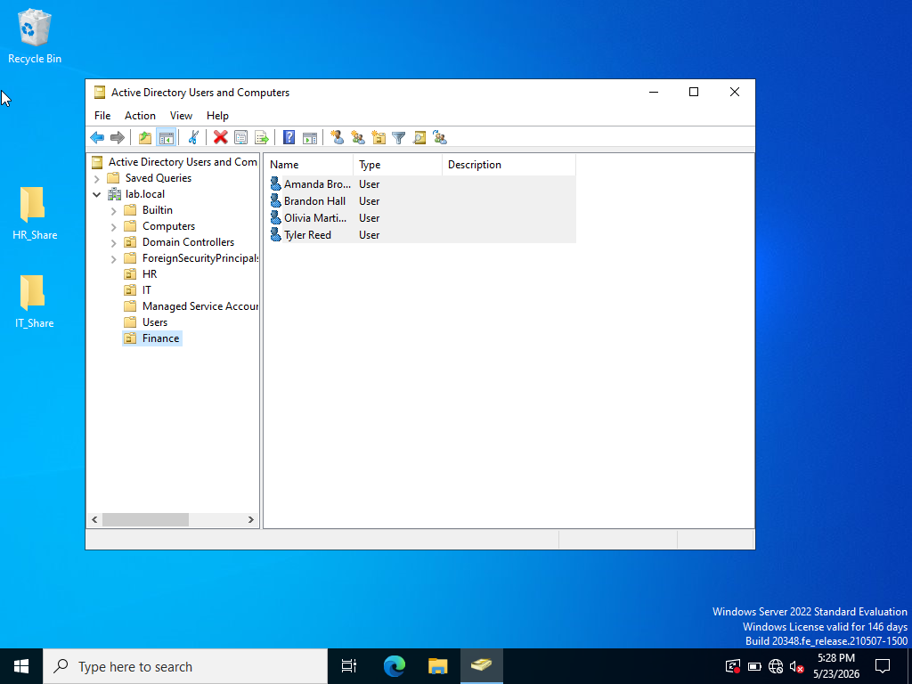
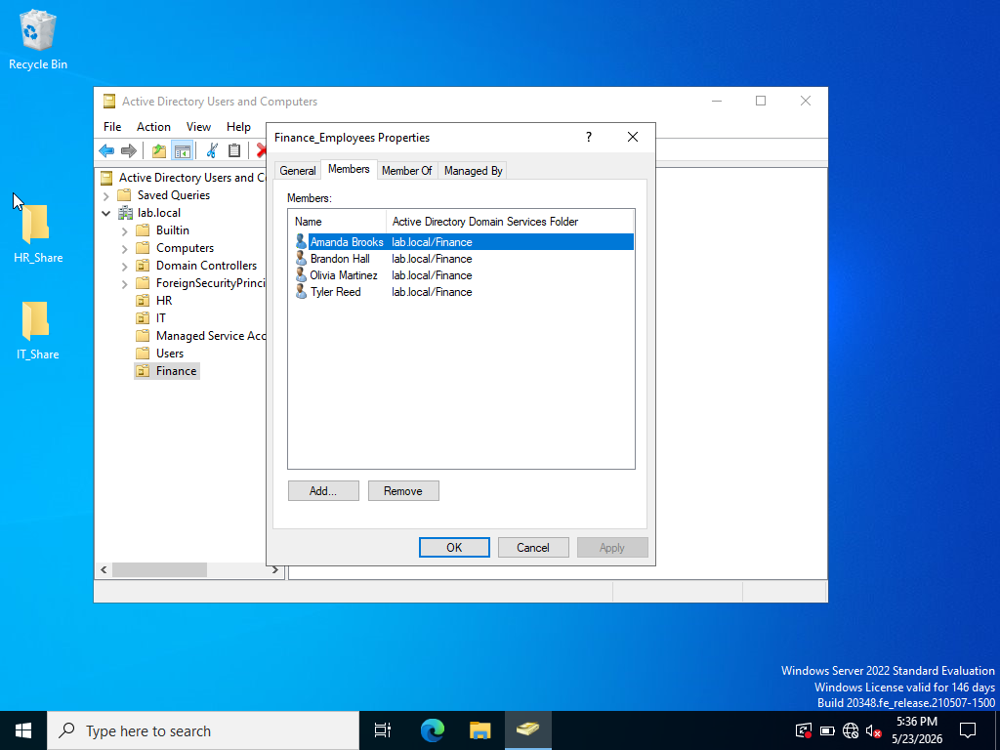
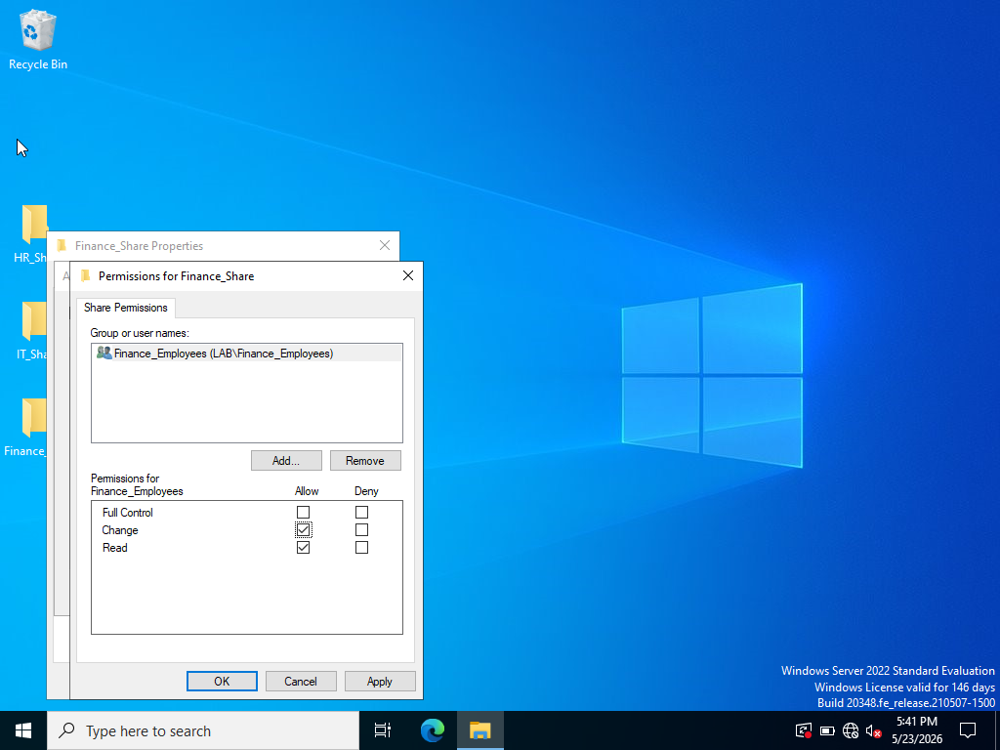
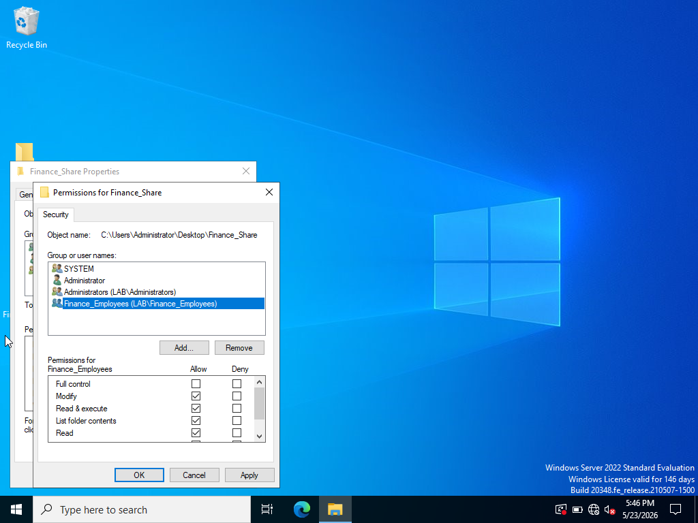
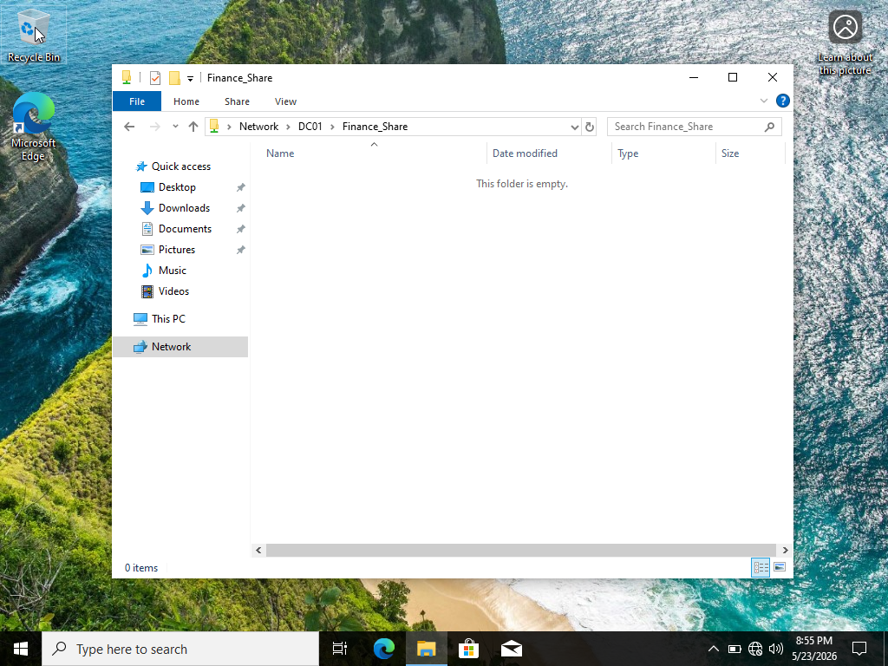

# Active Directory Department Shared Folder & Permissions

## Overview

This lab demonstrates how I configured group-based access to a departmental network share in a personal Active Directory home lab.

The scenario involved creating Finance department users, organizing them into a security group, assigning both Share and NTFS permissions to that group, and verifying access to the shared folder from a Windows client.

> **Note:** This is a personal home lab created for hands-on learning and does not represent professional production experience.

## Environment

- Windows Server 2022
- Active Directory Domain Services (AD DS)
- Active Directory Users and Computers (ADUC)
- Windows 10 client
- Domain: `lab.local`
- Security Group: `Finance_Employees`
- Network Share: `Finance_Share`

## Skills Practiced

- Active Directory user administration
- Security group management
- Group-based resource access
- Windows file sharing
- Share permissions
- NTFS permissions
- Network share access
- Access verification

## Scenario

A Finance department needed a shared network folder that department users could access.

Rather than assigning permissions individually to each user, I placed the Finance users into the `Finance_Employees` security group and assigned permissions to the group. This provided a more manageable approach to controlling access to the departmental resource.

## 1. Configure Finance Users

I created the Finance department user accounts within the Finance Organizational Unit in Active Directory.

## 2. Assign Users to the Finance Security Group

The Finance users were added to the `Finance_Employees` security group.

Using a security group allows resource permissions to be managed at the group level instead of assigning permissions separately to each user.

## 3. Configure Share Permissions

I assigned the `Finance_Employees` group access to the `Finance_Share`.

The group was granted:

- Change
- Read

Full Control was not assigned.

## 4. Configure NTFS Permissions

I also configured NTFS permissions on the underlying `Finance_Share` folder.

The `Finance_Employees` group was granted permissions including:

- Modify
- Read & execute
- List folder contents
- Read

## 5. Verify Client Access

After configuring the group membership, Share permissions, and NTFS permissions, I tested access from the Windows client.

The client successfully opened the shared resource through:

`\\DC01\Finance_Share`

## Result

The Finance departmental share was successfully configured and accessible from the client.

This lab demonstrated the relationship between:

**Active Directory Users → Security Groups → Share Permissions → NTFS Permissions → Resource Access**

## What I Learned

This lab helped me understand why permissions are commonly assigned to security groups rather than directly to individual users.

I also gained hands-on practice distinguishing between Share permissions and NTFS permissions. Both permission layers can affect a user's effective access when accessing a folder across the network.

Most importantly, I practiced verifying the final result from the client rather than assuming that the configuration was successful simply because the permissions had been assigned.
