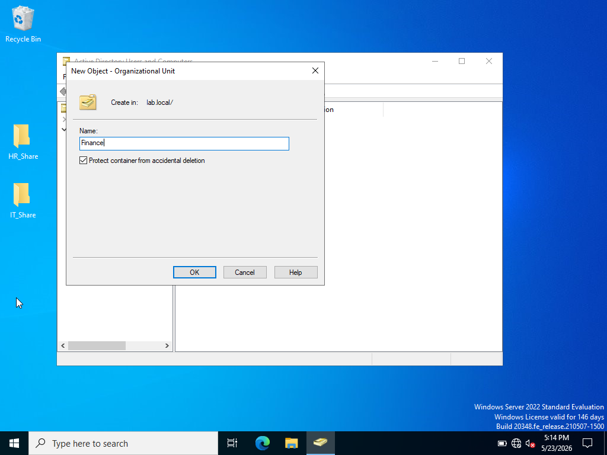
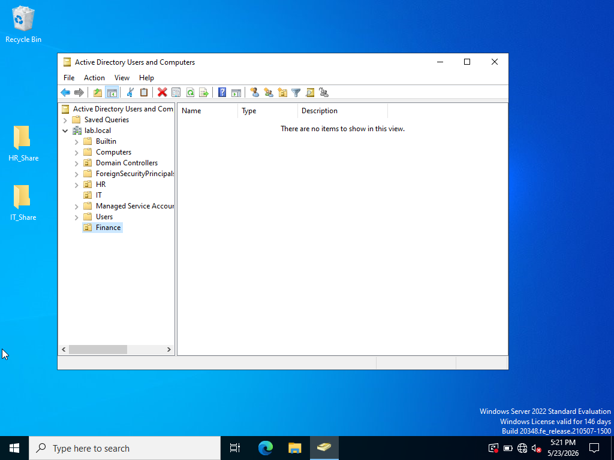
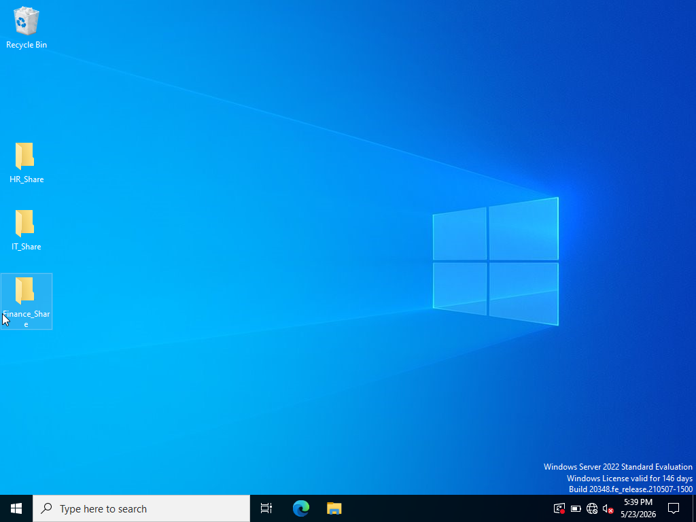

# Lab 18.5 — Active Directory Finance Department Shared Folder Permissions Lab

## Lab Objective
The purpose of this lab was to create a Finance department organizational structure in Active Directory, configure users and security groups, create a shared network folder, assign Share and NTFS permissions, and verify successful access from a client workstation.

-------------------------------------------------------------------

# Lab Environment

| Component | Details |
|---|---|
| Domain Controller | DC01 |
| Operating System | Windows Server 2022 |
| Client Machine | Windows 10 |
| Domain | lab.local |
| Tools Used | Active Directory Users and Computers, File Explorer, Share Permissions, NTFS Permissions |

-------------------------------------------------------------------

# Lab Tasks Completed

- Created Finance Organizational Unit (OU)
- Created Finance department users
- Created Finance_Employees security group
- Added users to Finance security group
- Created Finance shared folder
- Configured Share permissions
- Configured NTFS permissions
- Verified successful access from a client workstation

-------------------------------------------------------------------

# Step-by-Step Walkthrough

## Step 1 — Create Finance Organizational Unit (OU)

A new Organizational Unit named Finance was created inside Active Directory Users and Computers to organize Finance department accounts and resources.

### Screenshot

### Screenshot

-------------------------------------------------------------------

## Step 2 — Create Finance Department Users

Several Finance department user accounts were created inside the Finance OU.

Users created:
- Amanda Brooks
- Brandon Hall
- Olivia Martinez
- Tyler Reed

### Screenshot

-------------------------------------------------------------------

## Step 3 — Create Finance Security Group

A security group named Finance_Employees was created to simplify permission management for Finance users.

Group Configuration:
- Group Scope: Global
- Group Type: Security

### Screenshot

### Screenshot

-------------------------------------------------------------------

## Step 4 — Add Users to Finance Security Group

All Finance department users were added to the Finance_Employees security group.

This allows permissions to be managed through the group instead of configuring each user individually.

### Screenshot

-------------------------------------------------------------------

## Step 5 — Create Finance Shared Folder

A shared folder named Finance_Share was created on the domain controller desktop.

This folder will be used as a centralized network share for Finance department resources.

### Screenshot

-------------------------------------------------------------------

## Step 6 — Configure Share Permissions

Share permissions were configured for the Finance_Share folder.

Permissions assigned:
- Finance_Employees → Change
- Finance_Employees → Read

These permissions allow Finance employees to access and modify files inside the network share.

### Screenshot

-------------------------------------------------------------------

## Step 7 — Configure NTFS Permissions

NTFS permissions were configured on the Finance_Share folder.

Permissions assigned:
- Finance_Employees → Modify
- Finance_Employees → Read & Execute
- Finance_Employees → List Folder Contents
- Finance_Employees → Read

This ensured the Finance security group had proper filesystem-level access.

### Screenshot

-------------------------------------------------------------------

## Step 8 — Verify Client Access

The Finance shared folder was successfully accessed from the Windows 10 client workstation using the network path:

\\DC01\Finance_Share

Successful access confirmed that:
- DNS resolution worked correctly
- Share permissions were functioning
- NTFS permissions were functioning
- Finance group membership was applied correctly

### Screenshot

-------------------------------------------------------------------

# Key Concepts Learned

## Organizational Units (OUs)
Organizational Units are used in Active Directory to organize users, groups, and computers by department or role.

## Security Groups
Security groups simplify permission management by assigning permissions to groups instead of individual users.

## Share Permissions
Share permissions control network access to shared folders.

## NTFS Permissions
NTFS permissions control filesystem-level access on Windows drives and folders.

## Least Privilege
Permissions should only grant the minimum access necessary for users to perform their jobs.

-------------------------------------------------------------------

# Real-World Relevance

This lab simulated a real enterprise environment where IT administrators manage:
- Department-based access control
- Shared network folders
- Security groups
- Permission assignments
- Active Directory user management

These tasks are commonly performed in:
- Help Desk roles
- System Administration
- IAM (Identity and Access Management)
- Windows Server Administration
- Enterprise IT environments

-------------------------------------------------------------------

# Lab Summary

In this lab, a complete Finance department structure was created inside Active Directory. Users and security groups were configured, a shared network folder was created, Share and NTFS permissions were assigned, and successful access was verified from a client machine.

The lab demonstrated how Active Directory and Windows permissions work together to securely manage departmental resource access in an enterprise environment.
