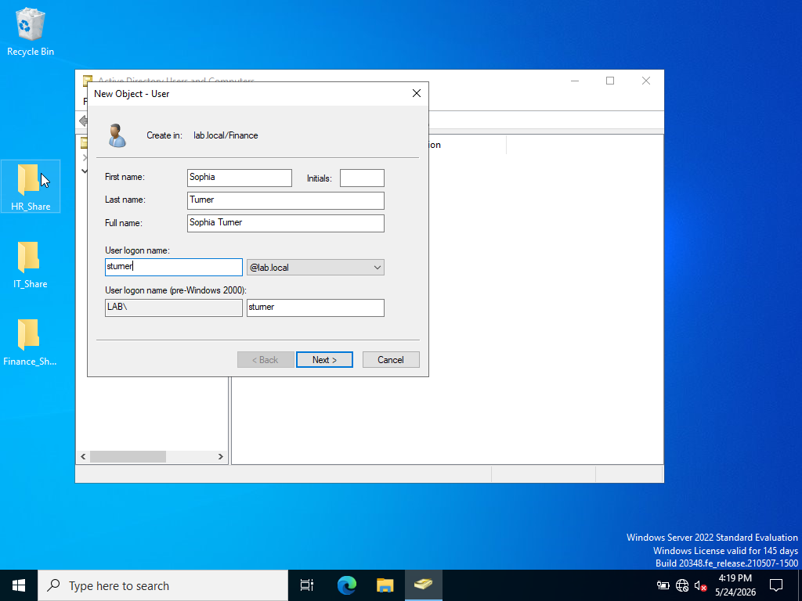
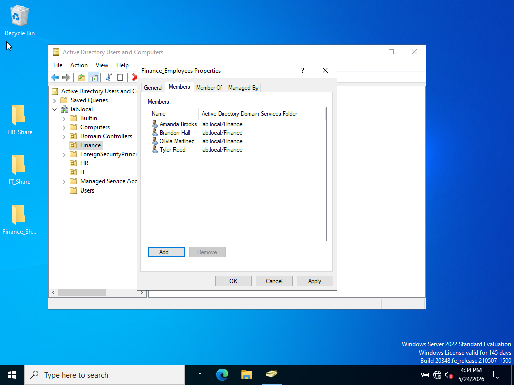
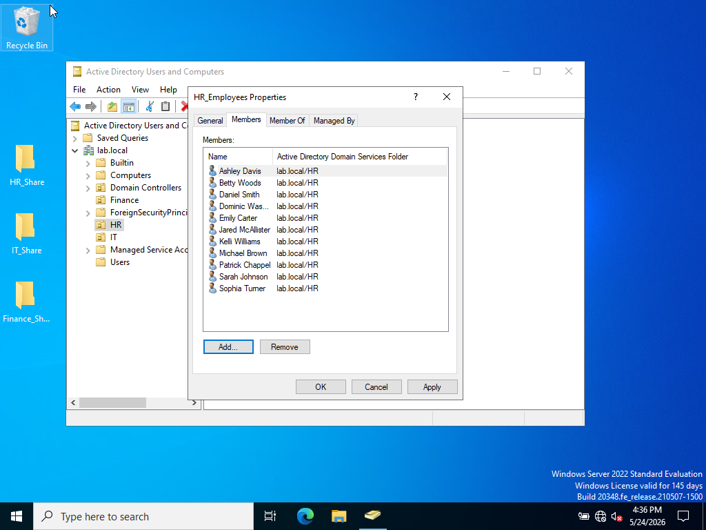
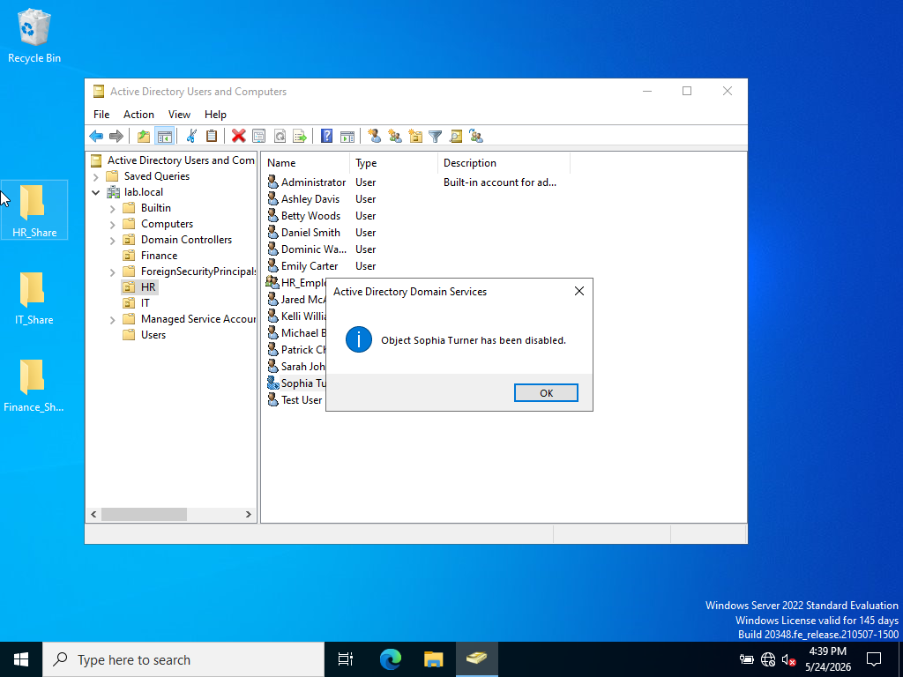
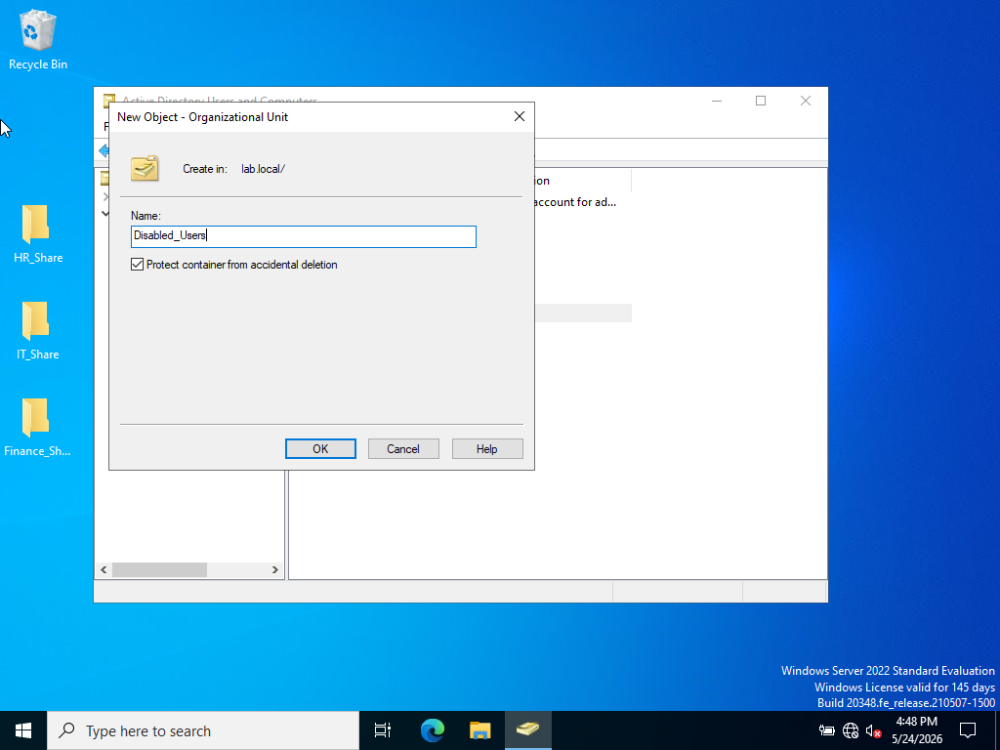
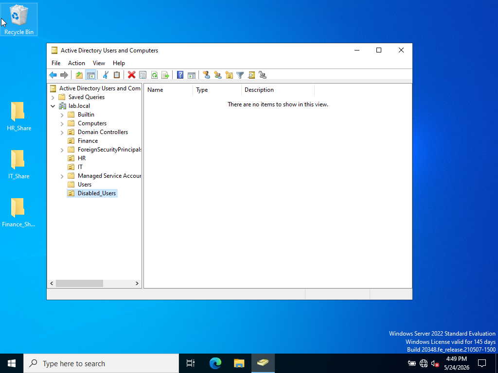
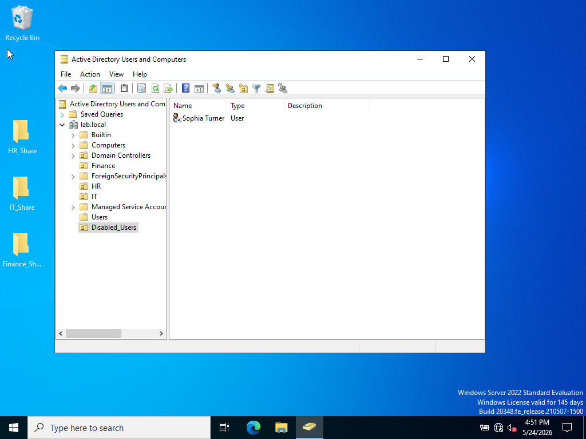

# Lab 19 – User Lifecycle Management in Active Directory

## Objective
The purpose of this lab was to practice managing the full lifecycle of a user account in Active Directory. Tasks included creating a new employee account, assigning group memberships, transferring the employee to a different department, removing old permissions, disabling the account, and organizing disabled accounts into a dedicated Organizational Unit (OU).

---

## Technologies Used
- Windows Server 2022
- Active Directory Users and Computers (ADUC)
- Organizational Units (OUs)
- Security Groups

---

# Step 1 – Create a New Finance User

A new user account for Sophia Turner was created inside the Finance OU. The account was configured with a username and prepared for Finance department access.

### Screenshot

---

# Step 2 – Verify User Creation

The new Finance employee account was successfully created and appeared inside the Finance OU.

### Screenshot

---

# Step 3 – Add User to Finance Security Group

Sophia Turner was added to the Finance_Employees security group. This granted her access to Finance department resources through group-based permissions.

Benefits of using security groups:
- Simplifies permission management
- Reduces administrative overhead
- Allows consistent access control across departments

### Screenshot

---

# Step 4 – Move User to HR Department

Sophia Turner was transferred from the Finance OU to the HR OU to simulate a departmental change within the organization.

This demonstrates how administrators can reorganize user accounts as employees change roles.

### Screenshot

---

# Step 5 – Remove Finance Department Access

Sophia Turner was removed from the Finance_Employees security group to revoke access to Finance department resources.

This follows the Principle of Least Privilege by ensuring users only maintain access required for their current role.

### Screenshot

---

# Step 6 – Add User to HR Security Group

Sophia Turner was added to the HR_Employees security group to grant proper HR department permissions and access.

### Screenshot

---

# Step 7 – Disable User Account

Sophia Turner’s account was disabled to simulate an employee termination or inactive account scenario.

Disabling accounts:
- Prevents user logins
- Preserves account information
- Maintains audit history
- Helps improve security

### Screenshot

### Screenshot

---

# Step 8 – Remove User from HR Group

After disabling the account, Sophia Turner was removed from the HR_Employees security group to fully revoke department access.

This prevents disabled accounts from retaining unnecessary permissions.

### Screenshot

---

# Step 9 – Create Disabled Users OU

A new Organizational Unit named Disabled_Users was created to store disabled employee accounts separately from active users.

Benefits of a Disabled Users OU:
- Improves organization
- Simplifies administration
- Helps with account auditing
- Keeps inactive accounts separated from active employees

### Screenshot

### Screenshot

---

# Step 10 – Move Disabled Account to Disabled Users OU

The disabled Sophia Turner account was moved into the Disabled_Users OU.

This demonstrates proper Active Directory account lifecycle management and organizational best practices.

### Screenshot

---

# Conclusion

In this lab, Active Directory user lifecycle management tasks were successfully completed. A new employee account was created, assigned permissions through security groups, transferred between departments, disabled, and archived into a dedicated Disabled Users OU.

Key concepts practiced:
- User account creation
- Security group management
- OU organization
- Access revocation
- Principle of Least Privilege
- Disabled account management
- Active Directory administrative best practices

This lab strengthened hands-on experience with real-world Active Directory administration tasks commonly performed by Help Desk, System Administrators, and IAM professionals.
